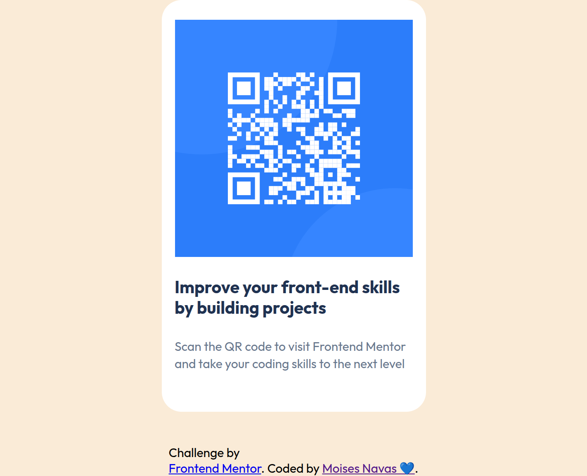

# Frontend Mentor - QR code component solution

This is a solution to the [QR code component challenge on Frontend Mentor](https://www.frontendmentor.io/challenges/qr-code-component-iux_sIO_H). Frontend Mentor challenges help you improve your coding skills by building realistic projects.

## Table of contents

- [Overview](#overview)
  - [Screenshot](#screenshot)
  - [Links](#links)
- [My process](#my-process)
  - [Built with](#built-with)
  - [What I learned](#what-i-learned)
  - [Continued development](#continued-development)
  - [Useful resources](#useful-resources)
  - [AI Collaboration](#ai-collaboration)
- [Author](#author)
- [Acknowledgments](#acknowledgments)

## Overview

### Screenshot

### Links

- Solution URL: [https://github.com/mnav08/QR-code-component.git]
- Live Site URL: [https://mnav08.github.io/QR-code-component/]

## My process

### Built with

- Semantic HTML5 markup
- CSS custom properties
- Flexbox
- Google fonts

### What I learned

- I learned how to put in practice the developer workflow. From opening the figma design and design system to the code implementation.
- Flexbox layout
- root variables to reuse in styles
- create reusable clases

## Author

### Moises Navas

- Website - [https://app.joinhandshake.com/profiles/mnv20]
- GitHub - [https://github.com/mnav08]
